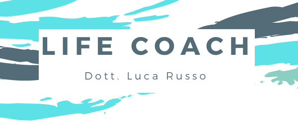

# PROGETTO Coaching OnLife

## Indice

1. [Informazioni Generali](#informazioni-generali)
2. [Tecnologie](#tecnologie)
3. [Installazione](#installazione)

## Informazioni Generali

Progetto in collaborazione con il Life Coach Luca Russo, che mi ha commissionato un sito semplice per rendere il suo lavoro più accessibile a un maggior numero di persone.

### LOGO



## Tecnologie

Questa è una lista di tecnologie usate nel progetto:

### Frontend :

- Typescript
- React.js

### Backend :

- MongoDB
- Node.js
- Express

## Installazione

Il modo più semplice è visitare il link [Luca Russo - Life Coach](https://example.com)

In alternativa :

```
$ git clone https://example.com
$ cd ../path/to/the/file
$ npm install
$ npm start
```
